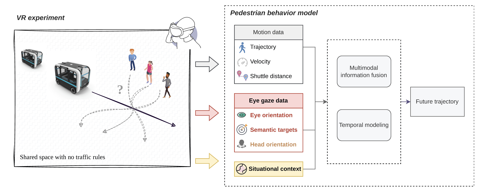

# Eye Gaze-Informed and Context-Aware Pedestrian Trajectory Prediction in Shared Spaces with Automated Shuttles: A Virtual Reality Study

[](https://opensource.org/licenses/MIT)
[](https://www.python.org/downloads/)
[](https://arxiv.org/abs/2603.19812)


## 👀 Overview

<p align="center">
  
</p>

**GazeX** is a multi-modal LSTM-based model for predicting pedestrian trajectories by integrating eye gaze dynamics, motion information, and contextual factors. We demonstrate that eye gaze provides complementary information to situational context for improved pedestrian behavior prediction in shared spaces with autonomous shuttles. The effects is further proven to be angle-dependent. 

**Key Contributions:**
- A VR dataset capturing pedestrian-shuttle interactions with systematic variations in approach angle (45°, 90°, 135°) and traffic patterns. 
- Comprehensive evaluation of eye gaze representations and their predictive power compared to head orientation; the effect is proven to be angle-dependent. 
- Evidence that gaze and contextual information provide complementary rather than redundant information.

For detailed experimental design, see [VRexpt.md](VRexpt.md)


## 🛠️ Setup

```bash 
conda create --name gazex python=3.12.9
conda activate gazex
conda install numpy==1.26.4
conda install pandas matplotlib scipy scikit-learn seaborn 
conda install pytorch::pytorch torchvision torchaudio -c pytorch tensorboard
pip install pytorch-tcn shap optuna
```

## 🚀 Training & Evaluation

### 📚 Training

```bash
# Train/evaluate from one config file
python run.py --config_filename data/config/multimodallstm.yaml

# Resume training/evaluation by editing experiment.ckpt_path in YAML,
# then running the same command.
```

### 🔍 Hyperparameter Optimization

```bash
# Run Optuna hyperparameter search
python tune.py --config_filename data/config/multimodallstm.yaml --n_trials 100

# View results with Optuna dashboard
optuna-dashboard sqlite:///logs/db.sqlite_training
```

All logs are in `logs/` folder. The best configuration files for each case are also located in each relevant folder. 


## 📊 Data

```
data 
├── config
├── indiv_time_o40_p40_s4 (storing the training/val/test data)
├── qn.csv (storing all questionnaire)
├── dfs.csv (storing preprocessed data from VR experiment)
├── dts.csv (storing all experimental setups)
└── questionnaire.pdf (questionnaire used in post-experiment)
```
These three csv files are ready to use for modeling. 


## 💻 Scripts

* `python -m utils.generate_data`: prepare data in correct format
* `python -m run --train`: to train a model
* `python -m run`: to evaluate a model 
* `python -m tune`: to tune hyperparameters
* `python -m utils.visualize`: to visualize predictions
* `python -m utils.eval`: to evaluate test performance by horizons

To run SHAP analysis, please change the forward function (both the definition and the return lines). 

The variable`use_headeye` supports 3 groups. For each group, the left column shows the name in the paper, the right column shows the name in code. 

| Eye direction  |              |   | Semantic targets       |                 |   | Head direction  |               |
|----------------|:------------:|---|------------------------|-----------------|---|-----------------|---------------|
| Eye-in-space   | `eye_asbdeg` |   | Gaze event             | `event_overall` |   | Head-in-space   | `head_in_space` |
| Eye-in-walking | `eye_in_walking` |   | Presence of attention  | `attn_overall`  |   | Head-in-walking | `head_in_walking` |
| Eye vislet     | `eye_vislet` |   | Attention on traffic   | `attn_traffic`  |   | Head vislet     | `head_vislet` |
| Eye+head       | `eye_n_head` |   | Attention distribution | `attn_detail`   |   |                 |               |