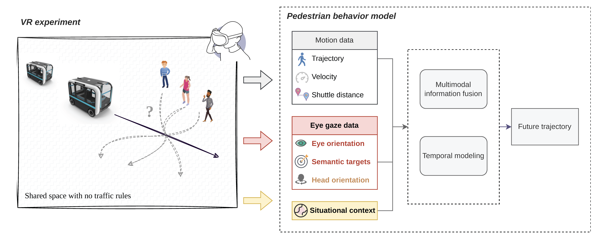

# Eye Gaze-Informed and Context-Aware Pedestrian Trajectory Prediction in Shared Spaces with Automated Shuttles: A Virtual Reality Study

[](https://arxiv.org/abs/2603.19812)
[](https://gazex-paper.github.io/)

## 👀 Overview


Can what a pedestrian *looks at* tell us where they will *go*? **GazeX-LSTM** fuses fine-grained eye gaze, motion, and situational context to predict pedestrian trajectories around automated shuttles — where prior models approximate attention with head orientation at best. We evaluate it on a VR dataset of 51 participants, varying shuttle approach angle (45°, 90°, 135°) and traffic conditions.

<p align="center">
  
</p>

**Key contributions:**
- **The predictive value of eye gaze is geometry-dependent.** Gaze beats head orientation at acute approach angles, where pedestrians turn their eyes rather than their head to track the shuttle — a direct consequence of eye-head-body coordination.
- **Gaze and context are complementary, not redundant:** together they cut final displacement error by **8.47%**, ≈ the sum of their individual gains.
- **Robustness quantified:** we identify the angular error at which each cue stops paying off, specifying the accuracy a remote sensing pipeline would need.
- **A new VR dataset** of 51 participants interacting with automated shuttles, with time-synchronized kinematics, head orientation, continuous gaze, and shuttle states — no public dataset combines gaze ground truth with controlled interaction geometry in this setting.

For detailed experimental design, see [VRexpt.md](VRexpt.md)


## 🛠️ Setup

```bash 
conda create --name gazex python=3.12.9
conda activate gazex
conda install numpy==1.26.4
conda install pandas matplotlib scipy scikit-learn seaborn 
conda install pytorch::pytorch torchvision torchaudio -c pytorch tensorboard
pip install pytorch-tcn shap optuna
```

## 🚀 Training & Evaluation

### 📚 Training

```bash
# Train/evaluate from one config file
python run.py --config_filename data/config/multimodallstm.yaml

# Resume training/evaluation by editing experiment.ckpt_path in YAML,
# then running the same command.
```

Training and evaluation are selected by the `train` flag in the YAML config (`train: true` trains, `train: false` evaluates across `random_seeds`), not by a command-line argument.

### 🔍 Hyperparameter Optimization

```bash
# Run Optuna hyperparameter search
python tune.py --config_filename data/config/multimodallstm.yaml --n_trials 100

# View results with Optuna dashboard
optuna-dashboard sqlite:///logs/db.sqlite_training
```

All logs can be downloaded at [here](https://drive.google.com/file/d/1CzYy9hicyN0BakVJARZkm2uYkJje-HOb/view?usp=sharing) and put in the `logs/` folder.


## 📊 Data

```
data 
├── config
├── indiv_time_o40_p40_s4 (storing the training/val/test data)
├── dfs.csv (storing preprocessed data from VR experiment)
├── dts_qn.csv (storing all experimental setups and questionnaire results)
└── questionnaire.pdf (questionnaire used in post-experiment)
```

`dfs.csv`, `dts_qn.csv`, and `indiv_time_o40_p40_s4/` are **available upon request** — please contact the corresponding author. They are ready to use for modeling; place them under `data/` as shown above.


## 💻 Scripts

**Data preparation**
* `python -m utils.integrate`: combine raw VR log files from all participants
* `python -m utils.generate_data`: prepare data in the correct format for modeling
* `python -m utils.split_data_by_angle`: split train/val/test sets by approach angle

**Training & evaluation**
* `python -m run`: train or evaluate a model (set `train` in the config; see above)
* `python -m tune`: tune hyperparameters with Optuna
* `python -m utils.eval`: evaluate test performance by prediction horizon
* `python -m utils.extract_best`: extract the best trial from Optuna tuning logs

**Analysis** (reproduces the paper's results)
* `python -m utils.eval_robustness`: robustness to gaze/head measurement error — injects angular noise, dropout, and eye→head substitution at inference time
* `python -m utils.hypothesis_testing`: significance tests between models (paired bootstrap, Wilcoxon, permutation)
* `python -m utils.detect_head_turns`: detect head look events for the eye-head-body coordination analysis
* `python -m utils.analyze_shap`: SHAP analysis of contextual variables
* `python -m utils.visualize`: visualize predicted trajectories

> **Note:** To run SHAP analysis, change the forward function (both the definition and the return lines).

The variable `use_headeye` supports 3 groups. For each group, the left column shows the name in the paper, the right column shows the name in code. 

| Eye direction  |              |   | Semantic targets       |                 |   | Head direction  |               |
|----------------|:------------:|---|------------------------|-----------------|---|-----------------|---------------|
| Eye-in-space   | `eye_asbdeg` |   | Gaze event             | `event_overall` |   | Head-in-space   | `head_in_space` |
| Eye-in-walking | `eye_in_walking` |   | Presence of attention  | `attn_overall`  |   | Head-in-walking | `head_in_walking` |
| Eye vislet     | `eye_vislet` |   | Attention on traffic   | `attn_traffic`  |   | Head vislet     | `head_vislet` |
| Eye+head       | `eye_n_head` |   | Attention distribution | `attn_detail`   |   |                 |               |


## 📝 Citation

If you find this work useful, please cite:

```bibtex
@article{li2026gazex,
  title   = {Eye Gaze-Informed and Context-Aware Pedestrian Trajectory Prediction
             in Shared Spaces with Automated Shuttles: A Virtual Reality Study},
  author  = {Li, Danya and Feng, Yan and Krueger, Rico},
  journal = {arXiv preprint arXiv:2603.19812},
  year    = {2026}
}
```